# Laporan pertemuan ke -2 sistem operasi
**Tanggal:** 23 Februari 2026  
**Disusun Oleh:** Rasyiq Satrio M
**NIM:** 254107020079
**Kelas/No:** TI-1G/25

## 1.1 Deteksi Perangkat Keras di Linux

## 1. Praktikum 2.1 — Identifikasi CPU dan Memori
1. tampilan informasi cpu:
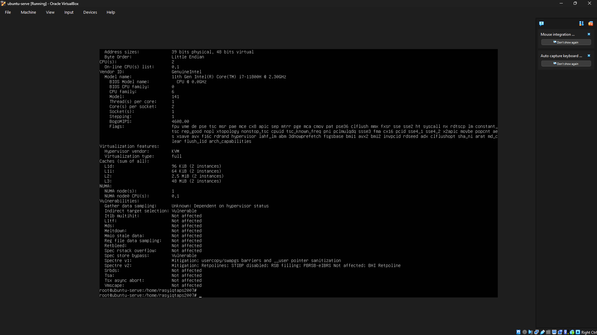

2. tampilan ringkasan memori:
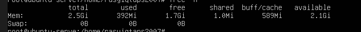

3. cek informasi hardware dari DMI/BIOS:

4. Catat: (1) jumlah CPU(s), core/thread, (2) total RAM, (3) total swap. Jelaskan perbedaan RAM vs swap dalam 2–3 kalimat.

jawab : jumlah cpu = 4, core/thread = 4/1, swap = 4GB.
RAM (Random Access Memory) adalah memori fisik berkecepatan tinggi yang menyimpan data aplikasi aktif agar dapat diakses secara instan oleh prosesor. Sebaliknya, Swap merupakan area pada penyimpanan sekunder (SSD/HDD) yang berfungsi sebagai memori cadangan saat kapasitas RAM penuh. Karena bergantung pada media penyimpanan fisik, performa Swap umumnya jauh lebih lambat dibandingkan RAM.

## 2.2 — Identifikasi Perangkat PCI/USB dan Driver
1. Lihat daftar perangkat PCI:
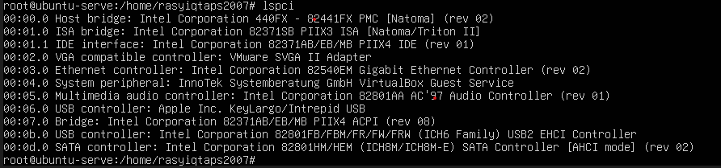

2. Lihat perangkat PCI beserta driver kernel yang digunakan:
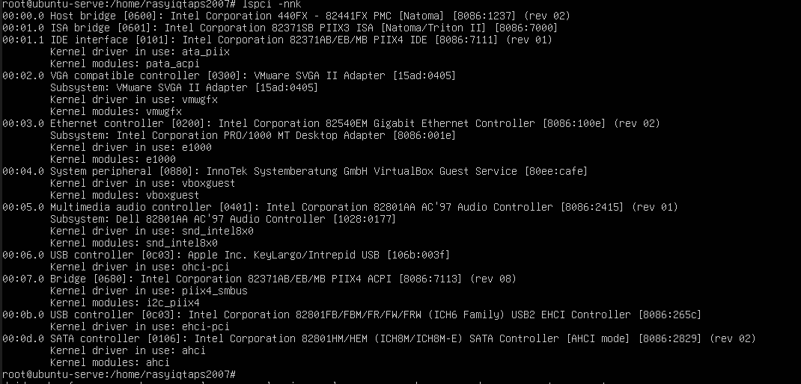

3. Fokus pada NIC (Ethernet) untuk mencari modul driver:
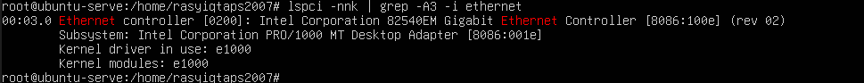

4. Lihat perangkat USB:
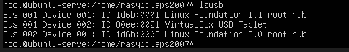

5. Lihat topologi USB (tree):

6. Temukan 1 perangkat PCI (misal NIC) dan tuliskan: Vendor:Device ID (angka heksadesimal), nama driver/modul kernel, dan deskripsi singkat fungsinya.

jawab : Sistem menggunakan Intel Corporation 82540EM Gigabit Ethernet Controller (ID 8086:100e) yang berjalan pada driver kernel e1000. Perangkat ini berfungsi sebagai antarmuka jaringan utama untuk memastikan pertukaran data berjalan stabil. Secara spesifik, pengontrol ini memungkinkan Ubuntu mendapatkan konfigurasi jaringan otomatis melalui DHCP dan memfasilitasi koneksi remote menggunakan SSH

## 2.3 — Identifikasi Storage dan Filesystem
1. Lihat daftar disk/partisi:
![informasi untuk melihat daftar blok perangkat beserta sistem filenya]
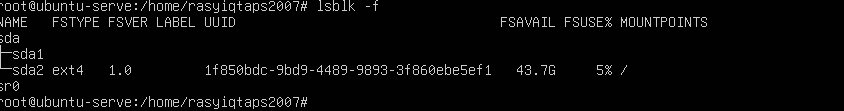

2. Tampilkan UUID dan tipe filesystem:
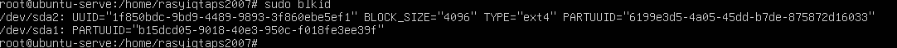

3. Lihat mount point untuk root filesystem:
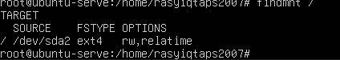

## 2.4 — Melihat Modul Aktif dan Informasinya
1. Cek versi kernel:
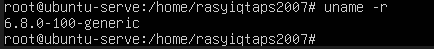

2. Tampilkan daftar modul aktif:
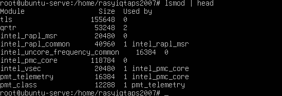

3. Pilih salah satu modul (contoh aman: loop) dan lihat detailnya:

4. Muat modul (jika belum aktif), lalu verifikasi:
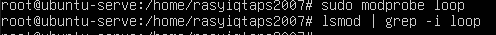

5. (Opsional) lihat pesan kernel terbaru:
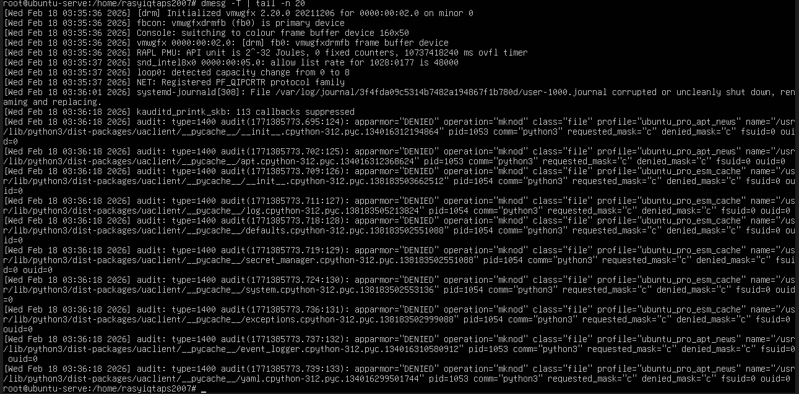

## 2.5 — Konfigurasi Auto-load dan Blacklist:
1. konfigurasi autoload dan blacklist modul
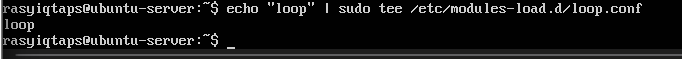
2. Simulasikan verifikasi (tanpa reboot) dengan memastikan modul sudah aktif
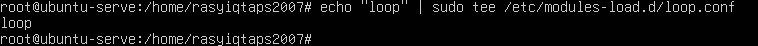

## 2.6 — Mengenali block vs character  device:
1. Lihat detail salah satu disk (sesuaikan dengan perangkat Anda, misal sda):
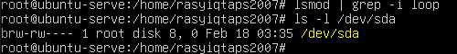

2. Lihat detail device terminal:
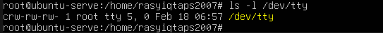

3. Lihat disk dan partisi untuk mengaitkan dengan /dev:
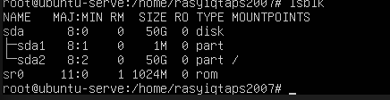

4. Dari output ls -l, jelaskan perbedaan penanda file untuk block device dan
character device. (Hint: karakter pertama pada permission string)

jawab : Pada sistem Linux, tipe file dapat diidentifikasi melalui karakter pertama pada output perintah ls -l:

ls -l /dev/sda: Karakter pertama adalah b, yang menandakan jenis filenya adalah Block Device (perangkat penyimpanan data).

ls -l /dev/tty: Karakter pertama adalah c, yang menandakan jenis filenya adalah Character Device (perangkat komunikasi seperti terminal).

## 2.7 — Melihat Informasi udev:
1. Cek atribut udev untuk disk:
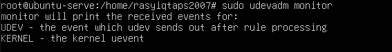

2. (Opsional) monitor event udev (jalankan, lalu colok/lepas USB pada mesin
fisik):
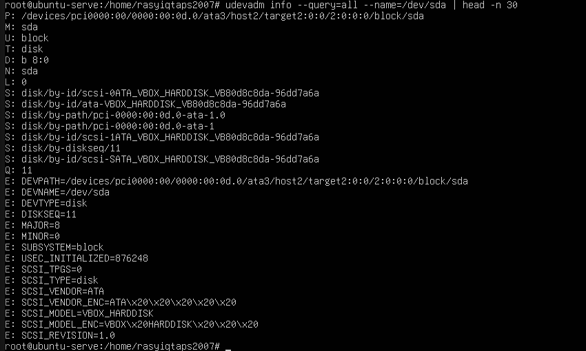

## 2.8 — Membuat Workspace Praktikum:
1. Buat direktori praktikum dan masuk ke dalamnya:
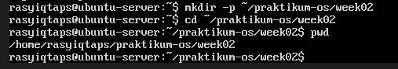

2. Buat beberapa file contoh:
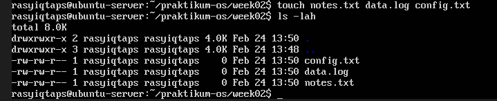

3. Isi file log contoh (simulasi):
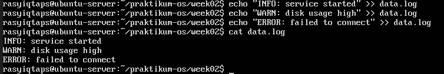

4. Baca file dengan less:
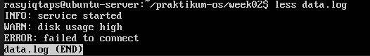

## 2.9 — Pencarian Pola dengan grep
1.  Cari baris yang mengandung ERROR pada data.log:
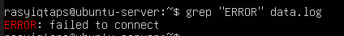

2. Cari tanpa memperhatikan huruf besar/kecil:
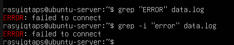

3. Tampilkan nomor baris:

4. Tampilkan baris yang tidak cocok (invert match):
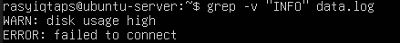

## 2.10 — Substitusi dengan sed (Aman di File Latihan)
1. Siapkan file konfigurasi latihan:
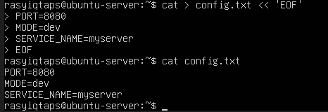

2. Ganti dev menjadi prod (tanpa mengubah file asli):
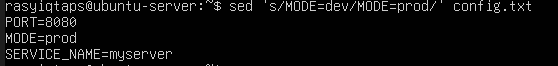

3. Terapkan perubahan langsung ke file (-i):
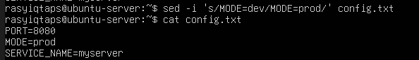

4. Ganti semua kemunculan kata (g untuk global), contoh ubah myserver menjadi
node:
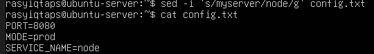

## 2.11  — Ekstraksi Kolom dengan awk
1. langkah 1-3 hasil:
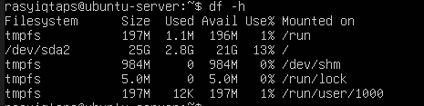

2. Ambil kolom filesystem dan persentase pemakaian:
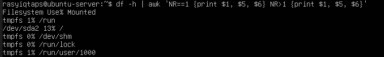

3. Filter hanya yang pemakaian disk di atas 80%:
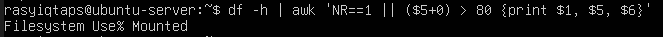

## 2.12 — Melihat Proses dengan ps
1. Tampilkan semua proses (format BSD):
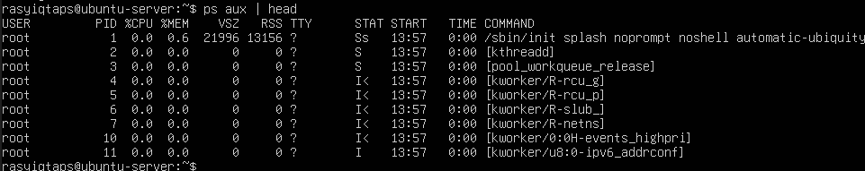

2. Cari proses tertentu (misal sshd):
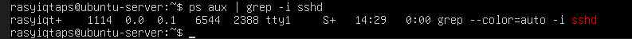

## 2.13 — Monitoring Real-time dengan top
1. Jalankan top:
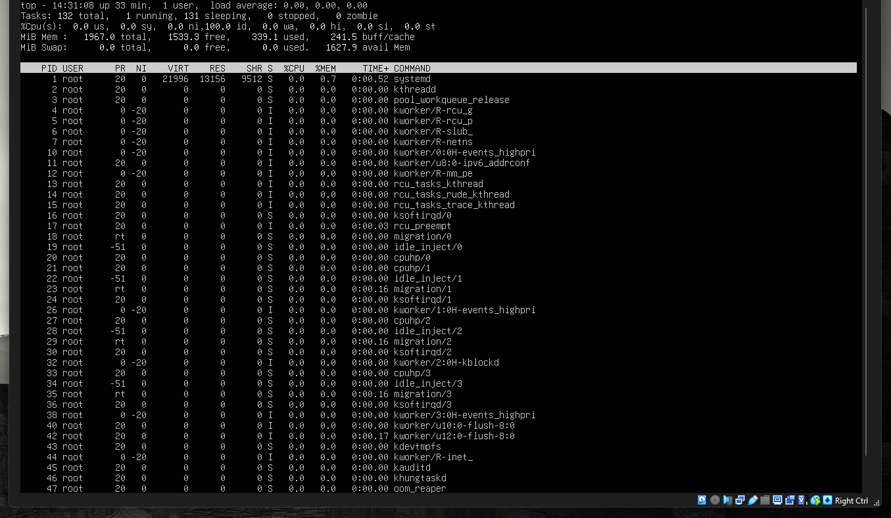

## 2.14 — Menghentikan Proses dengan kill
1. Jalankan proses dummy di background:
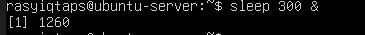

2. Cari PID proses sleep:
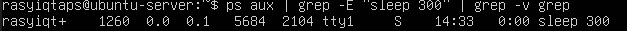

3. Hentikan dengan SIGTERM:
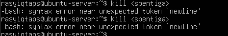

4. Verifikasi proses berhenti
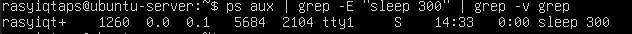

5. (Opsional) Jika proses sulit untuk dihentikan dan Anda membutukan untuk
menghentikan proses tersebut, gunakan SIGKILL:
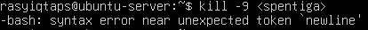

## 2.15 — Cek Disk, Load, dan Service
1. Cek penggunaan disk:
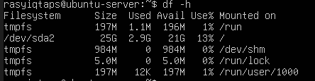

2. Cari direktori yang besar (contoh pada /var):
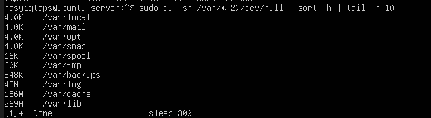

3. Cek load dan uptime:
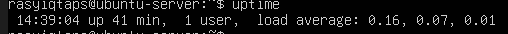

4. Cek service yang gagal:
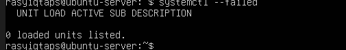

5. Ambil log error terbaru:
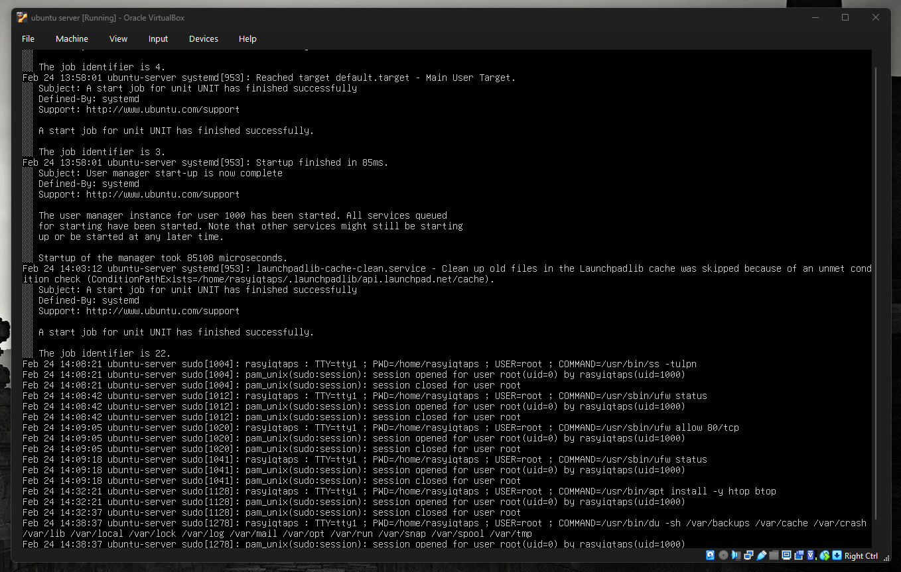

## 2.16 — Monitoring Port dan Koneksi (Network Basics)
1. Lihat interface dan IP:
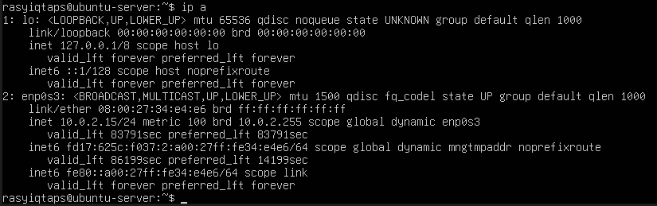

2. Lihat routing table:
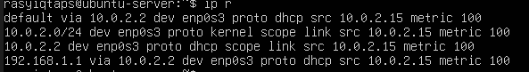

3. Lihat port yang sedang listening:
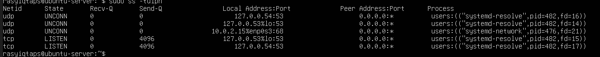

4. Pilih satu port yang listening dari output ss -tulpn(misal port 22), lalu
tuliskan service/proses yang membukanya. Jelaskan kegunaan port tersebut
secara singkat.

jawab: Layanan SSH berjalan melalui proses sshd pada port 22, yang memungkinkan akses jarak jauh (remote access) ke server secara aman melalui jaringan.

## 1.9 Latihan
1. 2.A Jalankan lspci -nnk. Pilih 1 perangkat PCI dan tuliskan: nama perangkat, ID vendor:device, dan kernel driver in use.

2. 2.B Tentukan device root filesystem dengan findmnt /. Lalu cocokkan dengan lsblk -f dan tuliskan tipe filesystem serta UUID-nya.

3. 2.C Buat file server.log berisi minimal 10 baris dengan variasi kata: INFO, WARN, ERROR. Gunakan grep untuk menampilkan hanya baris ERROR.

4. 2.D Gunakan sed untuk mengganti semua kata server menjadi node pada file latihan. Tunjukkan sebelum dan sesudah.

5. 2.E Gunakan df -h lalu awk untuk menampilkan filesystem yang penggunaan disk di atas 70%.

6. 2.F Jalankan sleep 600 &. Temukan PID-nya dengan ps. Hentikan dengan SIGTERM. Jelaskan beda SIGTERM vs SIGKILL.

7. 2.G Gunakan systemctl –failed. Jika tidak ada yang gagal, pilih satu service aktif (misal ssh) dan tampilkan status serta 30 baris log terakhirnya.
