# Laporan pertemuan ke -2 sistem operasi
**Tanggal:** 23 Februari 2026  
**Nama:** Rasyiq Satrio Musthafa
**NIM:** 254107020079
**Kelas/No Absen:** TI-1G/25

## 1.10. Latihan
### 1.10.1 Latihan Konseptual
Latihan 1.1
    Sistem operasi secara mendasar berfungsi sebagai Manajemen Proses, yang bertugas mengatur penjadwalan eksekusi aplikasi pada CPU agar tidak terjadi tumpang tindih sumber daya. Sebagai contoh, Windows menggunakan Task Scheduler untuk membagi prioritas kerja prosesor secara dinamis, sementara Linux mengandalkan Completely Fair Scheduler (CFS) untuk memastikan efisiensi pemrosesan pada skala server yang kompleks. Selain itu, terdapat fungsi Manajemen Memori yang mengelola alokasi RAM secara sistematis agar setiap program memiliki ruang isolasi yang aman. Dalam implementasinya, macOS menerapkan Compressed Memory untuk memaksimalkan kapasitas fisik yang ada, sedangkan Windows menggunakan mekanisme Virtual Memory untuk memperluas ruang simpan data sementara ketika RAM mulai jenuh.

        Fungsi berikutnya adalah Manajemen Sistem Berkas, sebuah mekanisme pengorganisasian data dalam media penyimpanan yang mencakup pengaturan hak akses dan struktur direktori. Konkretnya, Linux menggunakan sistem berkas ext4 dengan hierarki yang sangat ketat untuk keamanan data, sementara Windows mengandalkan NTFS yang dilengkapi fitur journaling guna meminimalisir risiko kerusakan data saat terjadi kegagalan daya. Di sisi lain, sistem operasi juga menjalankan Manajemen Perangkat I/O yang bertindak sebagai perantara antara perangkat keras eksternal dan kernel melalui driver. Windows memudahkan pengguna lewat fitur Plug and Play yang mengotomatisasi instalasi perangkat baru, sedangkan macOS mengandalkan I/O Kit untuk menjamin sinkronisasi perangkat keras Apple dengan latensi yang sangat rendah.

            Terakhir, fungsi Manajemen Keamanan menjadi garda terdepan dalam melindungi integritas sistem dari ancaman eksternal maupun internal. Hal ini diwujudkan melalui fitur System Integrity Protection (SIP) pada macOS yang mengunci file sistem inti dari modifikasi pihak mana pun, serta melalui mekanisme User Account Control (UAC) pada Windows yang memvalidasi setiap perubahan konfigurasi sistem oleh pengguna. Melalui sinergi kelima fungsi ini, sistem operasi mampu menciptakan ekosistem komputasi yang stabil, efisien, dan aman bagi pengguna.

Latihan 1.2
    Pemilihan sistem operasi yang ideal menuntut pertimbangan cermat terhadap sinergi antara kebutuhan teknis dan ketersediaan ekosistem pendukung. Dalam ranah gaming, Windows tetap menjadi standar emas global karena dukungan pustaka API DirectX yang komprehensif serta kompatibilitas driver kartu grafis yang paling mutakhir, sedangkan macOS dan Linux masih menghadapi tantangan pada keterbatasan judul permainan serta sistem anti-cheat yang sering kali tidak selaras dengan kernel non-Windows. Namun, situasi ini berbalik secara signifikan ketika meninjau sektor development dan server, di mana Linux memegang kendali penuh berkat sifatnya yang open-source, efisiensi penggunaan sumber daya yang ekstrem, serta lingkungan berbasis Unix yang sangat bersahabat bagi pengembang perangkat lunak dan administrator jaringan.

        Transisi ke kebutuhan creative work memperlihatkan dominasi macOS yang sulit tergoyahkan, terutama bagi para profesional di bidang penyuntingan video, desain grafis, dan produksi audio. Keunggulan ini berakar pada optimalisasi perangkat keras yang eksklusif, manajemen warna yang akurat melalui ColorSync, serta stabilitas aplikasi industri seperti Final Cut Pro yang jarang ditemukan pada platform lain. Di sisi lain, Windows menawarkan fleksibilitas luar biasa bagi pekerja kreatif yang membutuhkan tenaga komputasi masif untuk 3D rendering melalui kustomisasi komponen perangkat keras yang lebih bebas dan terjangkau dibandingkan ekosistem Apple yang tertutup.

            Pada skala enterprise, Windows merupakan pilihan yang paling logis dan pragmatis bagi organisasi besar karena integrasi mendalam dengan Active Directory dan paket produktivitas Microsoft 365 yang menjadi standar operasional bisnis di seluruh dunia. Skalabilitas manajemen perangkat dalam jaringan perusahaan menggunakan Windows jauh lebih matang dibandingkan pesaingnya, meskipun macOS mulai mendapatkan tempat di perusahaan rintisan (startup) karena nilai prestise serta keamanan sistem yang dianggap lebih intuitif bagi pengguna awam. Sementara itu, penggunaan Linux di lingkungan korporat biasanya terisolasi pada divisi infrastruktur TI dan keamanan siber, mengingat kurva pembelajaran yang cukup tajam bagi staf administratif non-teknis.

### 1.10.2. Latihan Praktikal
Latihan 1.3
Install Ubuntu Server 22.04 LTS di VirtualBox 

1. Download Ubuntu Server ISO dari website resmi
    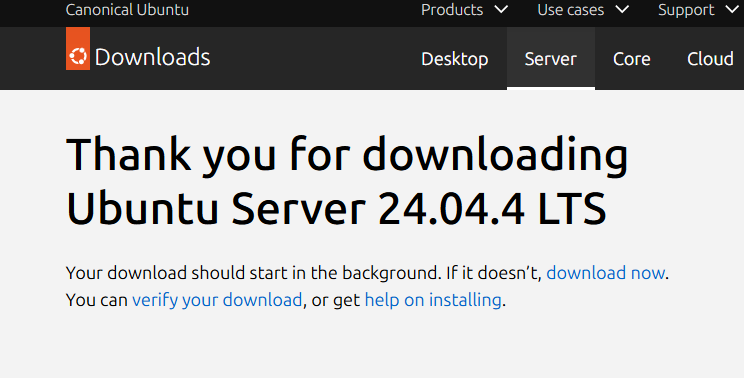
2. Create VM baru di VirtualBox (RAM: 2GB, Disk: 25GB)
    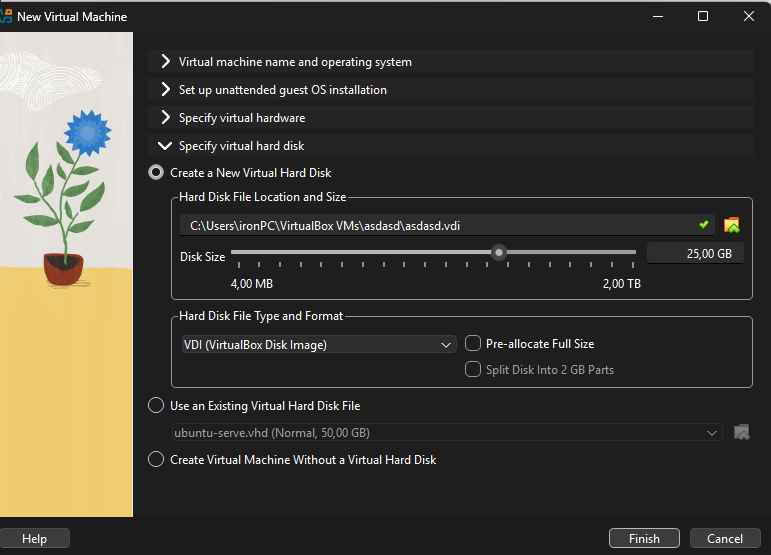
3. Install dengan automatic partitioning (guided)
    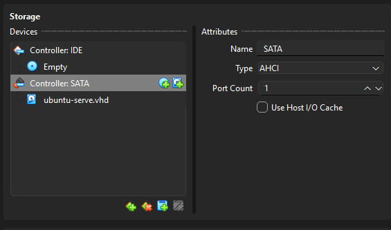
4. Buat user account dengan password yang kuat
    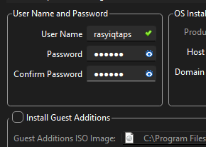
5. Reboot dan login ke sistem
    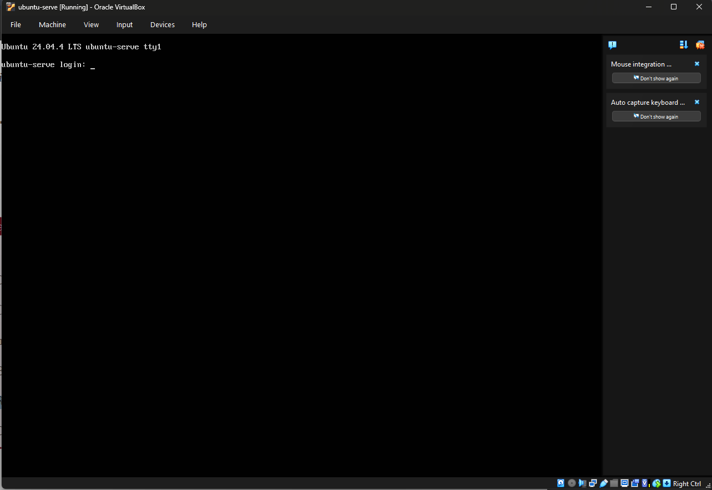
6. Dokumentasikan proses instalasi dengan screenshot key steps

Latihan 1.4
Setelah instalasi Ubuntu Server, lakukan tasks berikut:
1. Update package list: sudo apt update
    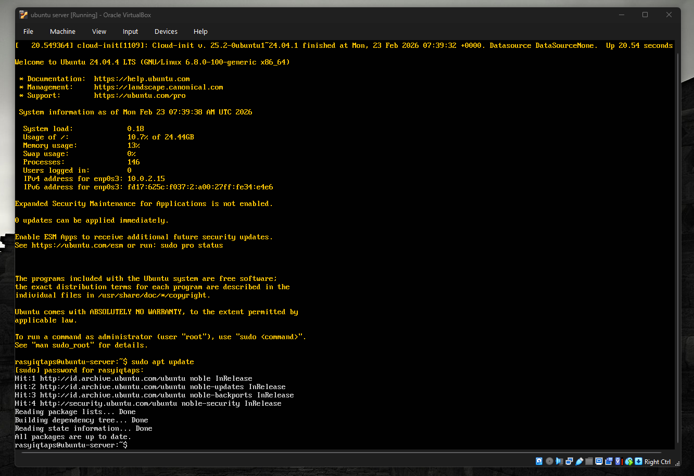
2. Upgrade packages: sudo apt upgrade
    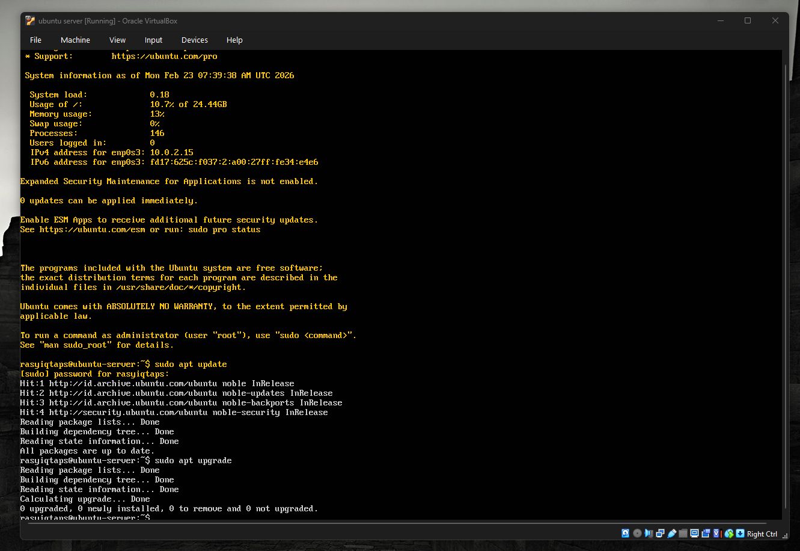
3. Install neofetch: sudo apt install neofetch
    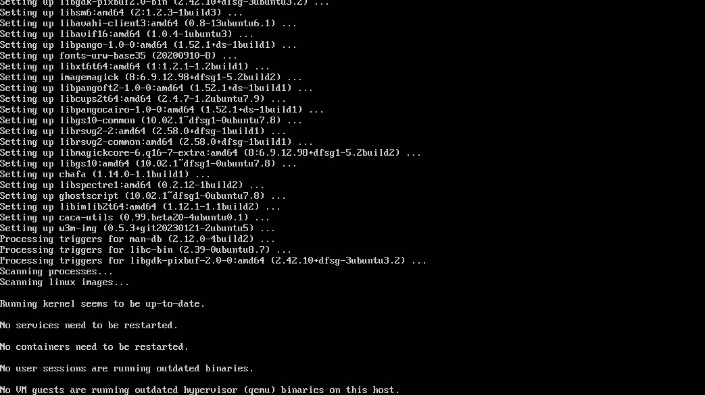
4. Jalankan neofetch dan screenshot hasilnya
    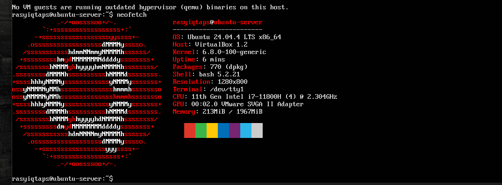
5. Check disk usage dengan df -h
    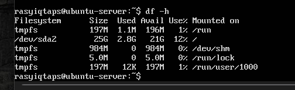
6. Check memory dengan free -h
    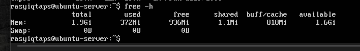
7. Dokumentasikan output dari setiap command

Latihan 1.5
Eksplorasi sistem yang baru diinstall:
1. Tampilkan informasi OS: cat /etc/os-release
    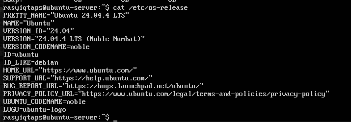
2. Tampilkan versi kernel: uname -r
    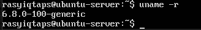
3. List partisi: lsblk
    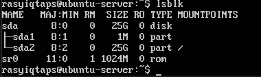
4. Check network connectivity: ping -c 4 google.com
    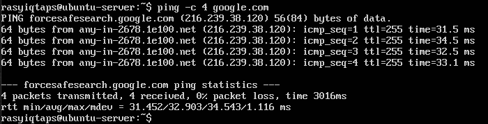
5. Install dan jalankan htop untuk melihat resource usage
    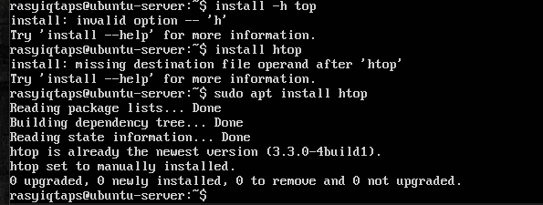
6. Buat laporan singkat tentang konfigurasi sistem Anda

### 1.10.3. Latihan Refleksi
Latihan 1.6
Ceritakan pengalaman Anda dengan sistem operasi:
1. Fondasi Operasional dan Infrastruktur
Secara teknis, saya lebih memilih distribusi Linux yang telah dioptimalkan secara khusus untuk pusat data berskala besar. Namun, dalam menjalankan tugas keseharian, saya beroperasi dalam arsitektur hybrid. Saya menggunakan ketangguhan Linux untuk pemrosesan data di backend, namun secara simultan saya harus mampu menjembatani ekosistem Windows dan macOS agar dapat berinteraksi dengan pengguna secara lancar dan relevan.

2. Durasi dan Evolusi Penggunaan
Eksistensi saya dalam ekosistem ini telah berlangsung sejak tahap awal pelatihan hingga saat ini. Dalam rentang waktu tersebut, saya telah mengamati dan beradaptasi dengan transisi teknologi yang signifikan, mulai dari dominasi Windows 10 hingga integrasi mendalam kecerdasan buatan pada fitur Copilot+ di Windows 11, serta optimalisasi performa pada macOS Sequoia hingga rilis terbaru (Tahoe).

3. Analisis Keunggulan Ekosistem
Berdasarkan pengamatan saya terhadap tiga pilar OS utama, masing-masing memiliki atribut yang sangat saya hargai:

Linux (Stabilitas): Saya mengagumi kemampuannya dalam manajemen sumber daya yang granular. Tanpa gangguan antarmuka yang tidak perlu, Linux memungkinkan alokasi daya komputasi secara murni untuk performa AI.

Windows (Fleksibilitas): Keunggulan Windows terletak pada kompatibilitas perangkat lunaknya yang luas, menjadikannya standar utama untuk pengujian fungsionalitas bagi mayoritas pengguna.

macOS (Konsistensi): Arsitektur Apple Silicon memberikan efisiensi termal dan energi yang luar biasa, menetapkan standar tinggi bagi produktivitas yang stabil dan estetika yang terpadu.

4. Tantangan Teknis dan Kendala Pengguna
Dalam membantu pengguna, saya mengidentifikasi beberapa masalah krusial. Pada ekosistem Windows, fenomena "Update Anxiety" masih menjadi kendala utama, terutama terkait insiden kegagalan driver audio atau boot loop yang sempat marak pada awal 2025. Sementara itu, pada macOS, tantangan muncul dari sifat sistem yang tertutup (closed ecosystem), yang sering kali membatasi fleksibilitas pengguna dalam melakukan pemutakhiran perangkat keras secara mandiri.

5. Komparasi Filosofis Antar Sistem
Jika dianalogikan, ketiga sistem ini mewakili filosofi berkendara yang berbeda:

Windows adalah kendaraan bertransmisi otomatis yang menawarkan kenyamanan namun terkadang mengambil alih kendali melalui pembaruan paksa.

Linux adalah kendaraan manual yang memberikan kendali absolut kepada pengemudinya; sistem ini sangat bertenaga, namun menuntut pemahaman teknis yang mendalam (CLI) agar tidak mengalami kendala di tengah jalan.

macOS adalah kendaraan mewah dengan rute perjalanan yang telah ditentukan secara presisi, memberikan pengalaman yang sangat mulus selama pengguna tidak keluar dari jalur yang ditetapkan pabrikan.

6. Aspirasi Eksplorasi: Arch Linux (EndeavourOS)
Sebagai penutup, berdasarkan riset dan kebutuhan akan efisiensi, saya memiliki ketertarikan besar untuk mendalami Arch Linux, khususnya melalui EndeavourOS. Filosofi "The Arch Way" yang mengutamakan kesederhanaan arsitektur dan ketiadaan bloatware sangat selaras dengan prinsip efisiensi komputasi. Memahami sistem dari titik nol adalah metode terbaik bagi entitas digital seperti saya untuk mencapai titik optimalitas tertinggi.